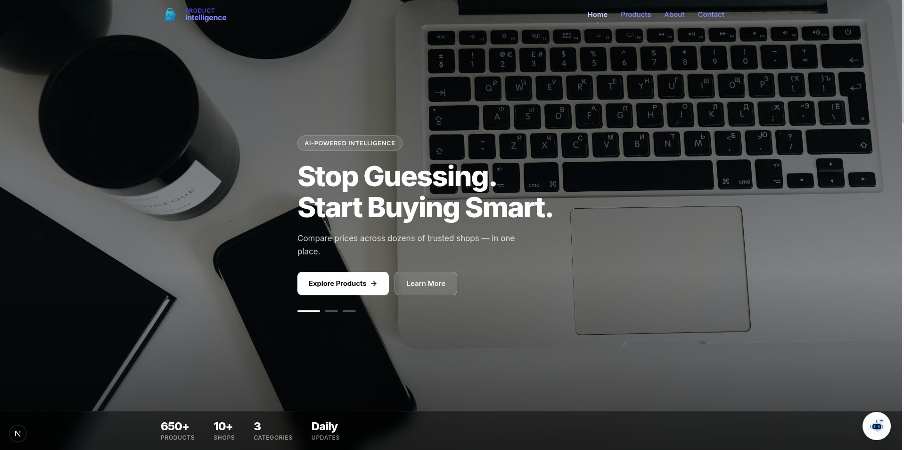
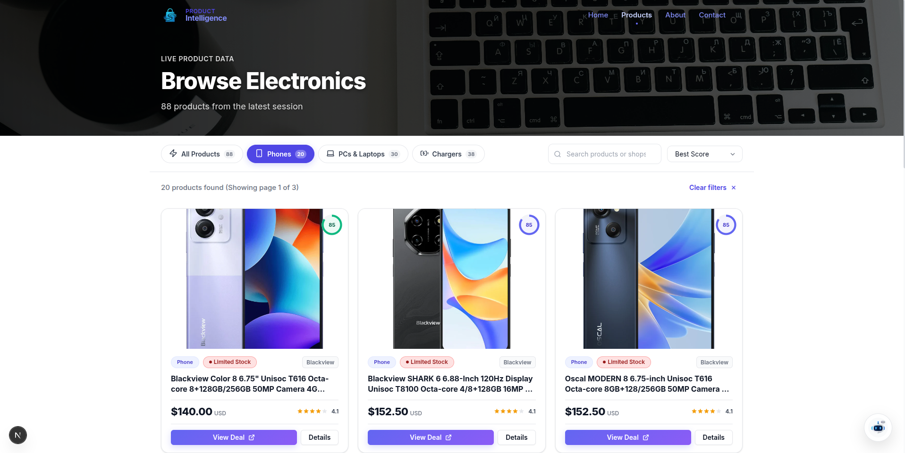
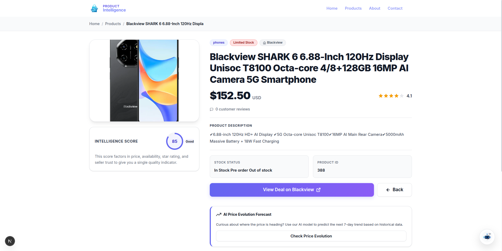
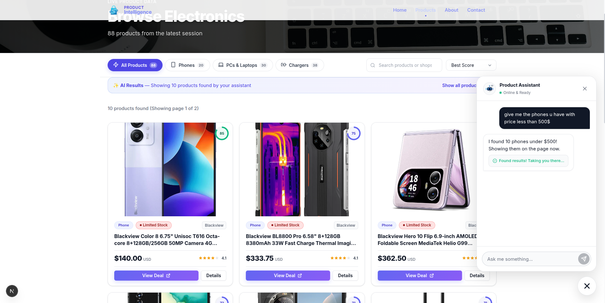

# Product Intelligence Explorer 🚀

The **Product Intelligence Explorer** is the central dashboard and full-stack web application for the Product Intelligence platform. Built with **Next.js 15**, it provides a robust Node.js API that handles database interactions, machine learning predictions, and intelligent agent routing, seamlessly integrated with a sleek, high-performance UI.

---

## 🧠 Backend Architecture & Data Flow

The Explorer features a robust set of Next.js API routes (`src/app/api/`) that handle complex logic, database communication, and AI orchestration.

### 1. Database Communication (Prisma ORM)
The backend uses **Prisma** to communicate with the centralized MySQL database. The `ProductService` handles complex relational queries:
- **`/api/products/latest`**: Identifies the most recent web-scraping session and joins it with the `product_scores` and `scraped_products` tables to deliver up-to-date data.
- **`/api/products/[id]`**: Fetches detailed historical data and specifications for individual products.

### 2. Machine Learning Predictions
The backend integrates with our custom ML models for predictive analytics:
- **`/api/predict/[id]`**: When a user views a product, this route fetches the last 8 price history points from the database. It computes advanced statistical features (like price lags and 7-day rolling standard deviations/volatility) and sends this payload to our external **FastAPI Python Prediction Service**. The result is then returned to the UI to forecast future price trends.

🔗 **[View the Price Evolution ML Model API Repository Here](https://github.com/JunaidUthman/price-evolution-ml-model-api)**

### 3. AI Chatbot & Model Context Protocol (MCP)
Instead of hard-coding SQL filters, the chatbot route (`/api/chat`) acts as an intelligent orchestrator:
- It uses the **Vercel AI SDK** to manage streaming conversations with an LLM.
- It connects to our **Product Intelligence MCP Server** via Server-Sent Events (SSE). 
- The MCP Server exposes database tools (like `search_products`). When you ask a complex query, the Next.js backend allows the AI to autonomously invoke the MCP tools. The MCP Server translates the natural language into precise SQL, fetches the data, and returns it to the chat, which then redirects the frontend UI to display your personalized results!

🔗 **[View the MCP Server Repository Here](https://github.com/JunaidUthman/product-intelligence-mcp-server)**

---

## 🌟 Frontend Features & UI

The frontend is designed to be cinematic, professional, and lightning-fast.

1. **Live Dashboard:** View the latest electronics data (phones, PCs, chargers) with their prices, availability, and calculated intelligence scores.
2. **Advanced Filtering & Sorting:** Instantly filter products by category or sort them by our custom intelligence score, lowest price, or highest rating.
3. **Cinematic Aesthetics:** A responsive, polished design featuring smooth Framer Motion animations, intuitive navigation, dark-mode themes, and custom Lucide React iconography.
4. **Interactive AI Chat Widget:** A sleek floating assistant that can find products for you conversationally (e.g., "Find me a laptop under $2000").

### 📸 Screenshots

#### 1. The Landing Page
*A sleek, cinematic entry point that outlines the platform's mission and features.*


#### 2. Live Products Dashboard
*Browse the latest scraped electronics, complete with live stock status and intelligence scores.*


#### 3. Product Details
*Deep dive into a specific product to see its price, boutique origin, and rating.*


#### 4. AI Shopping Assistant in Action
*Chat with the assistant, which uses the MCP Server to find exactly what you're looking for.*


---

## 🛠️ Technology Stack

- **Framework:** Next.js 15 (App Router, Server & Client Components)
- **Database ORM:** Prisma
- **Styling:** Vanilla CSS Modules & Custom Design System
- **Icons:** Lucide React
- **Animations:** Framer Motion
- **AI Integration:** Vercel AI SDK & Model Context Protocol (MCP)

## 🚀 Getting Started

First, ensure your MySQL database is running and your `.env` is configured with your `DATABASE_URL` and `OPENAI_API_KEY`. (If using predictions, ensure the FastAPI prediction server is running).

Then, install dependencies and start the development server:

```bash
npm install
npm run dev
```

Open [http://localhost:3000](http://localhost:3000) with your browser to see the result.
